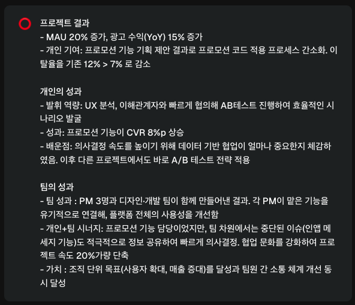
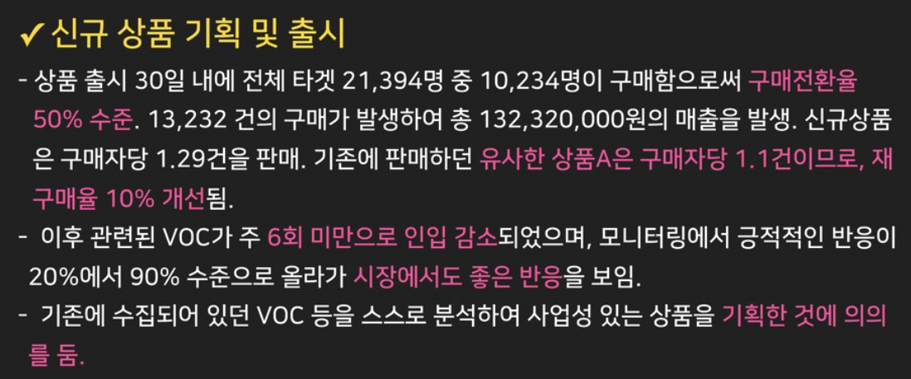
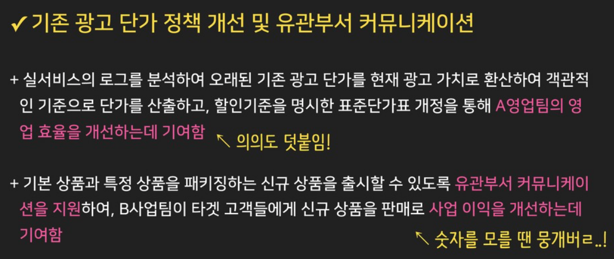
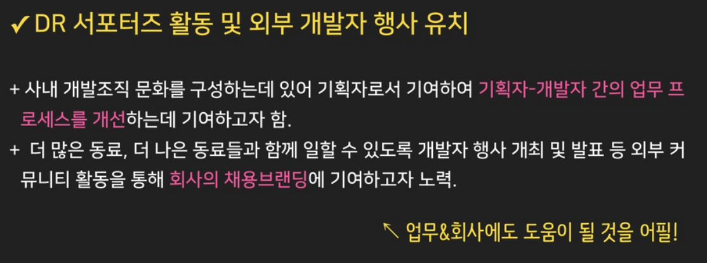

> [성과를 '더' 높이는 새해 목표 세우기](https://minieetea.com/20250104-self-evaluation/?fbclid=IwY2xjawHoGvVleHRuA2FlbQIxMQABHUL3RxZIV0OFcNehVJKDMMXyD0O0KBO0lwsY9mVN7Upf3dA1YEoa0FN3lw_aem_Rxq6XZwAhmvVujHNRprdAw)

# 성과란 무엇인가
```
배포: 프로젝트가 완성되어 프로덕트에 새로운 기능이나 서비스 형태로 공개 = 성취, 단순히 이루어낸 것
성과: 배포 이후 고객이 느끼는 실제적 가치와 비즈니스 목표 달성 여부로서의 결과 = 가치 증명
```
- 서비스 런칭, 특정 기능을 배포하여 고객에게 전달했다는 사실 자체는 '완료' 상황으로 '성과'가 아니다.
- 성과는 **배포 이후 실제로 만들어낸 가치와 결과**이다. 배포 이후 **측정 가능한 성과 지표** (제품 성과 또는 사업 성과)
	1. 사용자 만족도 변화
	2. 매출 증대
	3. 시장 점유율 향상 (세일즈)
	4. 고객 리텐션 확보 (석세스)
	5. 사용성 지표 개선

# 어떻게 작성해야 하는가

## 1. 프로젝트 성과와 개인 성과를 구분하여 본인의 기여도를 강조한다.
- 프로젝트의 성과는 개인의 성과가 아니다. 프로젝트 성과는 여러 부서와 팀의 협업 & 커뮤니케이션 & 역할 분담을 통한 결과이며, 공동으로 달성한 종합적인 지표이다. 
- **개인의 성과는 그 중에서 내가 직접적으로 담당한 업무와 기여도이다. 겉에서는 보기 어려웠던 기여감이 느껴져야 한다.**
### 질문
1. 프로젝트 성과는 무엇인가요?
	1. 목표 달성 여부: 프로젝트를 진행하면서 설정했던 목표가 어느 정도 달성되었나요?
		- 결과(Key Result, KR): 매출, 전환율, 유지율 (ex. 광고비 대비 전환율 15% 개선, 이탈률 10% 감소)
		- 목표 달성도: 프로젝트를 진행하면서 설정했던 목표가 어느 정도 달성되었는지를 나타내는 객관적 수치
	2. 목표 선정 방법: 해당 목표는 어떻게 선정했나요?
	3. 목표의 중요성: 해당 목표는 왜 중요한가요?
2. 그중에서 내가 직접적으로 기여한 바는 무엇인가요? 구체적으로 담당한 업무는 무엇인가요?
3. 어떤 역량을 발휘했나요?
4. 어떤 레슨런드를 얻었나요?
### 작성 방법
1. 프로젝트 결과를 언급한 후, 본인이 기여한 개인의 성과를 구체적으로 작성한다.
	- 아이디어, 실행 내용, 리더십 등
2. 개인의 성과에서 주요 역량과 학습 포인트를 강조한다.
	- 프로젝트 과정에서 어떤 역량을 발휘했는지
	- 어떤 레슨런드를 얻었는지

#### 예시


## 2. 과정 평가: 도전적 상황과 해결한 방식을 기반으로 문제 해결 역량과 협업 능력을 강조한다.
- 과제의 어려움과 과정 중에 발생한 문제를 잘 드러내고, **실제 문제 상황에서 본인이 어떻게 행동했는지에 대한 과정을 작성**해야 한다.
- 프로젝트 진행 과정에서 발생하는 현실적인 어려움의 예시
	- 예산 부족, 기술적 한계, 협업 파트너 간 이해 관계가 복잡하게 얽힌 상황
### 질문
- 과제를 진행하는 과정에서 어떤 도전적 상황이 있었나요? 과정 전반에서 드러난 문제가 무엇인가요?
- 어떻게 해결했나요? 어떤 단계를 거쳐 문제를 해결했나요?
	- 어떤 가설을 세웠나요?
	- 누구와 협업했나요?
- 어떤 역량을 발휘했나요?
- 어떤 레슨런드를 얻었나요?

### 작성 방법
- `문제 → 원인 분석 → 해결 전략 → 실행 결과` 의 흐름대로 구분하여 간결하게 서술한다.

#### 예시
```
문제 상황
- 데이터 검증 시스템이 미비하여 A/B 테스트 결과에 오류가 잦았다.

원인 분석
- 데이터 검증 시스템의 모니터링 절차가 부재

해결 전략
- 엔지니어와 협력하여 ~~~ 모니터링 절차를 추가로 마련

실행 결과
- 재발율이 n%에서 m%로 감소 (수치와 사례로 제시)
```

## 3. 사례를 기반으로 일하는 과정에서 보여준 태도와 조직 문화에 끼친 긍정적인 영향을 강조한다.
- 본인의 주도적인 태도나 협업 방식을 보여줄 수 있는 구체적인 경험를 작성한다. (ex. 기여도가 낮은 동료에게 피드백을 제공하여 성장을 유도, 다소 까다로운 이해관계자 사이에서 중립적인 조정자 역할을 맡아 협상안을 제안, ...)
- 조직문화와 태도는 '장기적인 팀 성과'와 '지속 가능한 협업 환경'을 조성한다는 측면에서 최근 더욱 강조되고 있다.
- 평가자의 관점을 고려해보면 더 많은 것이 보인다.
	- 회사가 추구하는 인재상, 전문가가 가져야 하는 성장 마인드셋, 팀에서의 직책과 부여된 역할에 보편적으로 요구되는 기대수준, ...
- 메신저가 아닌 메세지에 집중하여 피드백을 소화하면 본인에게 어떤 면이 있는지 알고, 메타 인지를 높일 수 있다.

### 질문
- 협업 과정에서 갈등이 발생했을 때 동료를 존중하며 해결했나요?
- 회사의 어떤 핵심 가치에 부합하는 태도를 보였나요? (ex. 고객 중심, 혁신, 실행력, ...)
- 프로젝트를 성공으로 이끌기 위해 적극적이고 능동적이며, 동료들을 배려하여 문제 해결에 집중할 수 있도록 몰입을 이끌었나요?
- 동료와의 신뢰를 구축하기 위해 어떤 노력을 실천했나요? (ex. 커뮤니케이션 방식의 변화, ...)
- 동료들이 일하고자 하는 마음이 들 수 있도록 독려하고 분위기를 조성하기 위해 어떤 노력을 실천했나요?


# 무엇을 작성해야 하는가
## 1. 큰 임팩트를 낸 성과가 있는 업무
1. 업무 기록을 살펴보며 지난 업무들을 추출한다.
2. 추출한 업무들을 분류하고, 항목 별로 가중치를 부여하여 정량화한다.
	- 항목 예시: 업무 관련성, 자발성, 비즈니스 목표 달성 기여 여부, 완료 여부, ...
3. 비슷한 업무들을 묶어서 성과의 크기를 키운다.
## 2. 본인의 포지션에 기대하는 역할과 책임, 역량에 부합하는 업무
- 상황에 따라 자주 변경될 수 있으니 평소 업무 진행 상황과 성과에 대해 대화를 나누면서 평가자가 원하는 역할을 인지해야 한다. 이를 통해 평가 기준을 리마인드 하고, 방향을 체크한다.
## 예시



